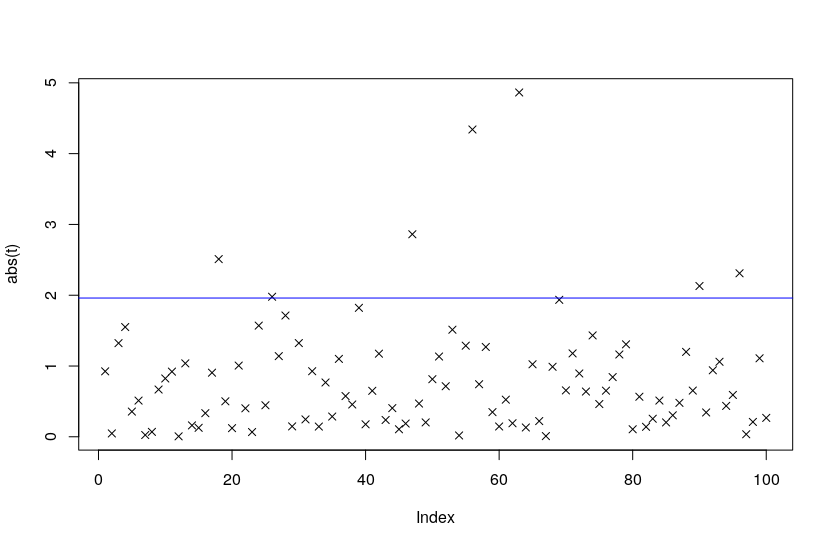

[](http://quantlet.de/)

## [](http://quantlet.de/) **phacking** [](http://quantlet.de/)

```yaml


Name of Quantlet : phacking

Published in :  'Dei ex machinis or the attractiveness of p-hacking'

Description : 'Data visualisation for phacking talk'

Keywords : phacking, data, noise, noisy data, hacking, hack, high frequency data, cryptocurrency

See also : quantlet
 
Author : 'Ilyas Agakishiev, Wolfgang Härdle'

Submitted : 'Mon, May 25 2020'


```



### R Code
```r

n 		= 10
J 		= 100
p 		= 0.025
q_p 	= -qnorm(0.025, 0, 1)
t 		= c( rep(0, J) )

for (j in 1:J){
  x   = runif(n)
  t[j]= sqrt(n) * ((mean(x) - 0.5)/sd(x))
  
  
  if (abs(t[j]) > q_p) 
  {
    p_Value = pnorm(abs(t[j]))
    print(t[j])
    print(1 - p_Value)  
  }  
}

plot( abs(t), pch=4 )
abline(h = q_p, col = "blue")
```

automatically created on 2020-05-25